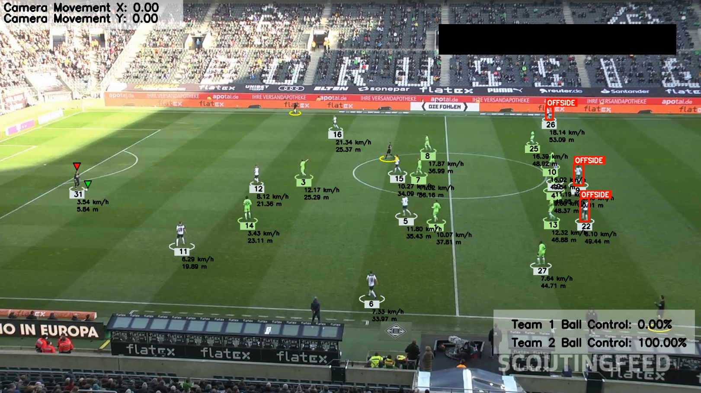

# Football Analysis — Dynamic Field & Offside Detection

## Overview

The goal of this original project is to detect and track players, referees, and footballs in a video using YOLO, one of the best AI object detection models available. We will also train the model to improve its performance. Additionally, we will assign players to teams based on the colors of their t-shirts using Kmeans for pixel segmentation and clustering. With this information, we can measure a team's ball acquisition percentage in a match. We will also use optical flow to measure camera movement between frames, enabling us to accurately measure a player's movement. Furthermore, we will implement perspective transformation to represent the scene's depth and perspective, allowing us to measure a player's movement in meters rather than pixels. Finally, we will calculate a player's speed and the distance covered. This project covers various concepts and addresses real-world problems, making it suitable for both beginners and experienced machine learning engineers.

Built on top of [Abhishek Sakapal's football-analysis](https://github.com/abhisheksakapal/football-analysis) pipeline, this fork adds **dynamic field area detection**, **camera zoom compensation**, and a **real-time offside detector**.



## My Contributions

### 1. Dynamic Field Area Detection
- Detects the visible field area **per frame** (not a static trapezoid) by intersecting white boundary lines with grass mowing patterns
- Adapts to camera pan, tilt, and zoom in real time
- Uses EMA-stabilized line tracking, DBSCAN clustering of grass stripes, and an anchor-based ROI to filter out advertising boards

### 2. Camera Zoom Compensation
- Measures zoom factor via optical flow on a 3×3 grid of features (original pipeline only estimated translation)
- Output format extended from `[Δx, Δy]` to `[Δx, Δy, zoom]`

### 3. Offside Detection
- Applies the FIFA offside rule per frame: penultimate defender + goalkeeper detection
- Automated attacking direction detection; handles missing goalkeeper (off-screen) gracefully
- Offside players get a red bounding box + "OFFSIDE" label in the output video

> Full technical details: [docs/TECHNICAL.md](docs/TECHNICAL.md)

## Base Pipeline

| Step | Module | Technology |
|------|--------|------------|
| 1 | Object Detection & Tracking | YOLOv8 + ByteTrack |
| 2 | Camera Movement | Lucas-Kanade Optical Flow |
| 3 | View Transformation | Perspective warp (pixels → metres) |
| 4 | Ball Interpolation | Pandas linear interpolation |
| 5 | Speed & Distance | Euclidean distance over frame windows |
| 6 | Team Assignment | K-Means jersey colour clustering |
| 7 | Ball Possession | Nearest-player distance threshold |

## Modules Used

- YOLO: AI object detection model
- K-Means: Pixel segmentation and clustering for jersey colour
- Optical Flow: Camera movement and zoom estimation
- Perspective Transformation: Scene depth and real-world coordinates
- Offside Detection: FIFA rule-based positional analysis

## Trained Models

- [Trained YOLO model](https://drive.google.com/file/d/1DC2kCygbBWUKheQ_9cFziCsYVSRw6axK/view?usp=sharing) → place in `models/best.pt`

## Sample Video

- [Sample input video](https://drive.google.com/file/d/1t6agoqggZKx6thamUuPAIdN_1zR9v9S_/view?usp=sharing) → place in `input_videos/match.mp4`

## Output Video

- [Current output video](https://drive.google.com/file/d/1mKb3jt0DKx-GBEeaTfd9c2OQ521DzOVa/view?usp=sharing) → place in `output_videos/output_video.mp4`

## Requirements

- Python 3.x
- ultralytics
- supervision
- opencv-python
- numpy
- matplotlib
- pandas
- shapely
- scikit-learn

```bash
pip install -r requirements.txt
```

## Usage

### Run locally

```bash
python main.py          # full pipeline → output_videos/output_video.avi
python yolo_inference.py # raw YOLO inference only
```

First run caches results to `stubs/`; subsequent runs load from cache. Set `read_from_stub=False` in `main.py` to force recomputation.

### Run on Google Colab

[](https://colab.research.google.com/github/PedoneMatteo/Tracking_football_players/blob/main/run_pipeline_football_analysis.ipynb)

No setup required — the notebook `run_pipeline_football_analysis.ipynb` clones the repo, installs dependencies, downloads the model and sample video, runs the pipeline, and lets you download the annotated output.

## Credits

- **Original project**: [@abhisheksakapal](https://github.com/abhisheksakapal/football-analysis)
- **Dynamic field detection, zoom compensation & offside module**: implemented on top of the original pipeline
- **YOLOv8**: Ultralytics | **ByteTrack**: supervision

## License

Inherits the license of the original [football-analysis](https://github.com/abhisheksakapal/football-analysis) repository.
